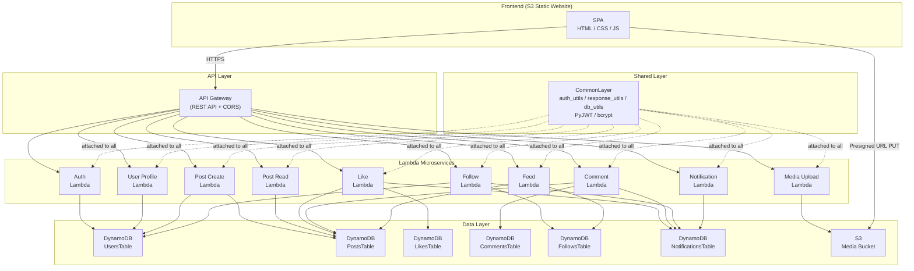

# Instagram-Lite 设计文档

> **课程**: CS6620 Cloud Computing — Northeastern University
> **项目名称**: InstaLite (Instagram-Lite)
> **技术栈**: AWS CDK v2 / Python 3.12 / Lambda / API Gateway / DynamoDB / S3

---

## 目录

1. [项目概述](#1-项目概述)
2. [架构图](#2-架构图)
3. [技术栈](#3-技术栈)
4. [微服务详情](#4-微服务详情)
5. [数据模型](#5-数据模型)
6. [认证流程](#6-认证流程)
7. [CDK Stack 架构](#7-cdk-stack-架构)
8. [部署指南](#8-部署指南)
9. [团队分工](#9-团队分工)
10. [演示脚本](#10-演示脚本)
11. [扩展性说明](#11-扩展性说明)
12. [项目结构](#12-项目结构)

---

## 1. 项目概述

InstaLite 是一个仿 Instagram 的轻量级社交媒体应用，以单页应用 (SPA) 的形式运行在浏览器中。后端完全采用 AWS Serverless 架构，由 **10 个 Lambda 微服务** 组成，通过 API Gateway 统一对外提供 RESTful API。

### 核心功能

| 功能模块 | 说明 |
|---------|------|
| 用户认证 | 注册、登录，JWT Token 鉴权 |
| 用户资料 | 查看与编辑个人主页（头像、昵称、简介） |
| 发布帖子 | 上传图片并创建带文字说明的帖子 |
| 浏览帖子 | 查看单条帖子详情、查看某用户的所有帖子 |
| 媒体上传 | 通过 S3 Presigned URL 直接从浏览器上传图片 |
| 点赞 | 对帖子进行点赞与取消点赞 |
| 评论 | 在帖子下方发布与浏览评论 |
| 关注 | 关注/取关其他用户，查看粉丝与关注列表 |
| 信息流 | 聚合已关注用户的最新帖子（Fan-out-on-read） |
| 通知 | 接收点赞、评论、关注事件的实时通知 |

### 设计目标

- **全 Serverless**: 零服务器管理，按需付费，自动弹性伸缩
- **基础设施即代码**: 使用 AWS CDK v2 (Python) 定义全部云资源，一键部署
- **微服务架构**: 每个业务域独立为一个 Lambda 函数，职责单一，便于独立开发和测试
- **前后端分离**: 前端为纯静态 SPA，托管在 S3 上，通过 CORS 调用后端 API

---

## 2. 架构图



### 请求流程简述

1. 用户在浏览器中访问 S3 托管的前端 SPA
2. SPA 通过 HTTPS 调用 API Gateway 提供的 RESTful 接口
3. API Gateway 将请求代理转发至对应的 Lambda 函数（Lambda Proxy Integration）
4. Lambda 函数通过共享层中的工具库进行 JWT 鉴权、数据库操作和响应封装
5. 数据持久化在 DynamoDB 中，图片存储在 S3 中
6. 图片上传采用 Presigned URL 模式：前端先从 Media Lambda 获取签名 URL，再直接 PUT 到 S3

---

## 3. 技术栈

### 后端

| 组件 | 技术 | 说明 |
|------|------|------|
| 运行时 | Python 3.12 | Lambda 运行时 |
| IaC 框架 | AWS CDK v2 (`aws-cdk-lib >= 2.100.0`) | 基础设施即代码 |
| 计算 | AWS Lambda | 10 个微服务，256 MB 内存，30s 超时（Feed 为 60s） |
| API 网关 | API Gateway (REST API) | 统一入口，CORS 支持，`prod` 阶段部署 |
| 数据库 | Amazon DynamoDB | 6 张表，按需计费模式 (PAY_PER_REQUEST) |
| 对象存储 | Amazon S3 | 图片存储桶 + 前端静态网站托管桶 |
| 认证 | PyJWT + bcrypt | 自定义 JWT Token，密码 bcrypt 哈希 |
| 共享层 | Lambda Layer | 包含 `auth_utils`、`response_utils`、`db_utils` 及第三方依赖 |

### 前端

| 组件 | 技术 | 说明 |
|------|------|------|
| 框架 | 原生 HTML / CSS / JavaScript | 无框架依赖的 SPA |
| 托管 | S3 Static Website Hosting | 配置 `index.html` 作为入口和错误页 |
| 路由 | 自定义 `router.js` | Hash-based 前端路由 |

### 开发工具

| 工具 | 用途 |
|------|------|
| Conda | Python 虚拟环境管理（环境名 `cs6620`） |
| AWS CLI | 资源管理和前端部署 |
| curl | API 测试脚本 |

---

## 4. 微服务详情

本项目包含 10 个独立的 Lambda 微服务，每个微服务对应一个业务域。所有 Lambda 共享一个公共层 (CommonLayer)，复用鉴权、响应格式化和数据库操作逻辑。

### 4.1 Auth 微服务 (认证)

**代码路径**: `lambda_code/auth/index.py`

负责用户注册和登录。注册时校验用户名唯一性，使用 bcrypt 哈希密码后存储；登录时验证密码并签发 JWT Token。

| 端点 | 方法 | 说明 | 鉴权 |
|------|------|------|------|
| `/auth/signup` | POST | 用户注册 | 无需 |
| `/auth/login` | POST | 用户登录 | 无需 |

**请求示例** — 注册:

```json
POST /auth/signup
{
  "username": "alice",
  "email": "alice@example.com",
  "password": "password123"
}
```

**响应示例**:

```json
{
  "token": "eyJhbGciOiJIUzI1NiIs...",
  "user": {
    "userId": "uuid-xxxx",
    "username": "alice",
    "displayName": "alice"
  }
}
```

**业务规则**:
- 用户名不可重复（通过 GSI `username-index` 查询验证）
- 密码长度不得小于 6 位
- 注册成功后自动签发 JWT Token，无需再次登录

**依赖的 DynamoDB 表**: `UsersTable` (读写)

---

### 4.2 User Profile 微服务 (用户资料)

**代码路径**: `lambda_code/user_profile/index.py`

支持查看任意用户的公开资料以及编辑自己的个人信息。返回数据时自动移除 `passwordHash` 字段。

| 端点 | 方法 | 说明 | 鉴权 |
|------|------|------|------|
| `/users/{userId}` | GET | 获取用户资料 | 无需 |
| `/users/{userId}` | PUT | 更新用户资料 | 需要 |

**可更新字段**: `displayName`、`bio`、`avatarUrl`

**请求示例** — 更新资料:

```json
PUT /users/{userId}
Authorization: Bearer <token>
{
  "displayName": "Alice W.",
  "bio": "Photographer & traveler"
}
```

**权限控制**: 仅允许用户编辑自己的资料（`token.userId == pathParam.userId`）

**依赖的 DynamoDB 表**: `UsersTable` (读写)

---

### 4.3 Post Create 微服务 (发布帖子)

**代码路径**: `lambda_code/post_create/index.py`

处理创建新帖子的请求。帖子必须包含图片 URL（通常由 Media Upload 微服务预先生成）。成功创建后会原子递增用户的 `postCount` 计数。

| 端点 | 方法 | 说明 | 鉴权 |
|------|------|------|------|
| `/posts` | POST | 创建新帖子 | 需要 |

**请求示例**:

```json
POST /posts
Authorization: Bearer <token>
{
  "imageUrl": "https://bucket.s3.amazonaws.com/uploads/uid/photo.jpg",
  "caption": "Beautiful sunset!"
}
```

**业务规则**:
- `imageUrl` 为必填字段
- 自动记录 `userId`、`username`、`createdAt` 时间戳
- 初始 `likeCount` 和 `commentCount` 均为 0

**依赖的 DynamoDB 表**: `PostsTable` (读写)、`UsersTable` (读写，更新 `postCount`)

---

### 4.4 Post Read 微服务 (浏览帖子)

**代码路径**: `lambda_code/post_read/index.py`

提供帖子的读取功能：通过 `postId` 查看单条帖子详情，或通过 `userId` 查看某用户的全部帖子（按时间倒序）。

| 端点 | 方法 | 说明 | 鉴权 |
|------|------|------|------|
| `/posts/{postId}` | GET | 获取单条帖子 | 无需 |
| `/users/{userId}/posts` | GET | 获取用户的帖子列表 | 无需 |

**查询参数**:
- `limit` — 返回帖子数量上限，默认 `20`

**实现细节**: 用户帖子列表通过 GSI `userId-createdAt-index` 查询，`ScanIndexForward=False` 保证按时间倒序返回。

**依赖的 DynamoDB 表**: `PostsTable` (只读)

---

### 4.5 Media Upload 微服务 (媒体上传)

**代码路径**: `lambda_code/media/index.py`

生成 S3 Presigned URL，允许前端直接将图片上传至 S3，避免图片数据经过 Lambda 中转。

| 端点 | 方法 | 说明 | 鉴权 |
|------|------|------|------|
| `/media/presign` | POST | 获取上传签名 URL | 需要 |

**请求示例**:

```json
POST /media/presign
Authorization: Bearer <token>
{
  "contentType": "image/jpeg",
  "filename": "sunset.jpg"
}
```

**响应示例**:

```json
{
  "uploadUrl": "https://bucket.s3.amazonaws.com/uploads/uid/uuid.jpg?X-Amz-...",
  "imageUrl": "https://bucket.s3.amazonaws.com/uploads/uid/uuid.jpg",
  "key": "uploads/uid/uuid.jpg"
}
```

**业务规则**:
- 仅支持 `image/*` 类型的文件
- Presigned URL 有效期为 300 秒（5 分钟）
- 上传路径格式：`uploads/{userId}/{uuid}.{ext}`

**依赖的 AWS 资源**: S3 Media Bucket (PUT + READ 权限)

---

### 4.6 Like 微服务 (点赞)

**代码路径**: `lambda_code/like/index.py`

管理帖子的点赞和取消点赞操作，同时在点赞时向帖子作者发送通知。

| 端点 | 方法 | 说明 | 鉴权 |
|------|------|------|------|
| `/posts/{postId}/like` | POST | 点赞帖子 | 需要 |
| `/posts/{postId}/like` | DELETE | 取消点赞 | 需要 |
| `/posts/{postId}/likes` | GET | 获取点赞列表 | 无需 |

**业务规则**:
- 使用 DynamoDB 条件写入 (`ConditionExpression`) 防止重复点赞，返回 409 冲突
- 点赞/取消时原子更新帖子的 `likeCount`
- 点赞时若点赞者不是帖子作者，自动创建 `LIKE` 类型通知

**依赖的 DynamoDB 表**: `LikesTable` (读写)、`PostsTable` (读写)、`NotificationsTable` (写)

---

### 4.7 Comment 微服务 (评论)

**代码路径**: `lambda_code/comment/index.py`

处理帖子评论的创建与读取，同时在评论时向帖子作者发送通知。

| 端点 | 方法 | 说明 | 鉴权 |
|------|------|------|------|
| `/posts/{postId}/comments` | POST | 发表评论 | 需要 |
| `/posts/{postId}/comments` | GET | 获取评论列表 | 无需 |

**业务规则**:
- 评论内容不可为空，且不超过 500 个字符
- 评论成功后原子递增帖子的 `commentCount`
- 评论列表按时间正序排列 (`ScanIndexForward=True`)
- 评论时若评论者不是帖子作者，自动创建 `COMMENT` 类型通知（含评论预览，前 50 字符）

**依赖的 DynamoDB 表**: `CommentsTable` (读写)、`PostsTable` (读写)、`NotificationsTable` (写)

---

### 4.8 Follow 微服务 (关注)

**代码路径**: `lambda_code/follow/index.py`

管理用户之间的关注关系，支持关注、取消关注以及查看粉丝和关注列表。

| 端点 | 方法 | 说明 | 鉴权 |
|------|------|------|------|
| `/users/{userId}/follow` | POST | 关注用户 | 需要 |
| `/users/{userId}/follow` | DELETE | 取消关注 | 需要 |
| `/users/{userId}/followers` | GET | 获取粉丝列表 | 无需 |
| `/users/{userId}/following` | GET | 获取关注列表 | 无需 |

**业务规则**:
- 不允许关注自己（返回 400）
- 使用条件写入防止重复关注（返回 409）
- 关注/取关时原子更新双方的 `followerCount` / `followingCount`
- 关注时自动创建 `FOLLOW` 类型通知
- 粉丝列表通过 GSI `followee-index` 查询

**依赖的 DynamoDB 表**: `FollowsTable` (读写)、`UsersTable` (读写)、`NotificationsTable` (写)

---

### 4.9 Feed 微服务 (信息流)

**代码路径**: `lambda_code/feed/index.py`

聚合当前用户所关注的全部用户的最新帖子，采用 **Fan-out-on-read** 策略，使用多线程并行查询。

| 端点 | 方法 | 说明 | 鉴权 |
|------|------|------|------|
| `/feed` | GET | 获取信息流 | 需要 |

**查询参数**:
- `limit` — 返回帖子数量上限，默认 `20`

**实现细节**:
1. 查询 `FollowsTable` 获取当前用户关注的所有用户 ID（上限 100）
2. 使用 `ThreadPoolExecutor` 并行查询每个被关注用户的最新 10 条帖子（最大并发 10 线程）
3. 将所有帖子按 `createdAt` 倒序排序后截取前 `limit` 条返回

**性能说明**: Lambda 超时设为 60 秒（其他微服务为 30 秒），以应对大量并行查询的场景。

**依赖的 DynamoDB 表**: `FollowsTable` (只读)、`PostsTable` (只读)

---

### 4.10 Notification 微服务 (通知)

**代码路径**: `lambda_code/notification/index.py`

提供通知的查询和已读标记功能。通知由其他微服务（Like、Comment、Follow）在触发事件时写入。

| 端点 | 方法 | 说明 | 鉴权 |
|------|------|------|------|
| `/notifications` | GET | 获取通知列表 | 需要 |
| `/notifications/{notifId}/read` | PUT | 标记通知已读 | 需要 |

**响应示例** — 获取通知:

```json
{
  "notifications": [
    {
      "userId": "uid-bob",
      "notifId": "1700000000000#uuid",
      "type": "LIKE",
      "sourceUsername": "alice",
      "message": "alice liked your post",
      "isRead": false,
      "createdAt": 1700000000000
    }
  ],
  "unreadCount": 1
}
```

**业务规则**:
- 通知列表按时间倒序返回（最多 50 条）
- 响应中包含未读通知计数 `unreadCount`
- 支持三种通知类型：`LIKE`、`COMMENT`、`FOLLOW`

**依赖的 DynamoDB 表**: `NotificationsTable` (读写)

---

## 5. 数据模型

本项目使用 6 张 DynamoDB 表，全部采用 **按需计费模式** (PAY_PER_REQUEST)，无需预置容量。所有表的 `RemovalPolicy` 设为 `DESTROY`，便于开发阶段清理。

### 5.1 UsersTable

存储用户账户信息与个人资料。

| 属性 | 类型 | 说明 |
|------|------|------|
| `userId` (PK) | String | 用户唯一 ID (UUID) |
| `username` | String | 用户名，唯一 |
| `email` | String | 邮箱地址 |
| `passwordHash` | String | bcrypt 哈希后的密码 |
| `displayName` | String | 显示名称 |
| `bio` | String | 个人简介 |
| `avatarUrl` | String | 头像 URL |
| `postCount` | Number | 帖子数（原子计数器） |
| `followerCount` | Number | 粉丝数（原子计数器） |
| `followingCount` | Number | 关注数（原子计数器） |
| `createdAt` | Number | 注册时间戳（毫秒） |

**全局二级索引 (GSI)**:

| 索引名 | 分区键 | 投影 | 用途 |
|--------|--------|------|------|
| `email-index` | `email` (String) | ALL | 通过邮箱查找用户 |
| `username-index` | `username` (String) | ALL | 登录时通过用户名查找、注册时校验唯一性 |

---

### 5.2 PostsTable

存储帖子内容。

| 属性 | 类型 | 说明 |
|------|------|------|
| `postId` (PK) | String | 帖子唯一 ID (UUID) |
| `userId` | String | 发布者的用户 ID |
| `username` | String | 发布者的用户名（冗余存储，减少联表查询） |
| `imageUrl` | String | 图片 URL |
| `caption` | String | 帖子文字说明 |
| `likeCount` | Number | 点赞数（原子计数器） |
| `commentCount` | Number | 评论数（原子计数器） |
| `createdAt` | Number | 创建时间戳（毫秒） |

**全局二级索引 (GSI)**:

| 索引名 | 分区键 | 排序键 | 投影 | 用途 |
|--------|--------|--------|------|------|
| `userId-createdAt-index` | `userId` (String) | `createdAt` (Number) | ALL | 按时间倒序获取某用户的帖子列表 |

---

### 5.3 LikesTable

存储点赞记录，使用复合主键确保一个用户对一条帖子只能点赞一次。

| 属性 | 类型 | 说明 |
|------|------|------|
| `postId` (PK) | String | 帖子 ID |
| `userId` (SK) | String | 点赞用户 ID |
| `createdAt` | Number | 点赞时间戳（毫秒） |

**全局二级索引 (GSI)**:

| 索引名 | 分区键 | 排序键 | 投影 | 用途 |
|--------|--------|--------|------|------|
| `userId-index` | `userId` (String) | `createdAt` (Number) | ALL | 查询某用户点赞过的帖子 |

---

### 5.4 CommentsTable

存储评论数据。

| 属性 | 类型 | 说明 |
|------|------|------|
| `postId` (PK) | String | 帖子 ID |
| `commentId` (SK) | String | 评论唯一 ID (UUID) |
| `userId` | String | 评论者的用户 ID |
| `username` | String | 评论者的用户名 |
| `text` | String | 评论内容（上限 500 字符） |
| `createdAt` | Number | 评论时间戳（毫秒） |

> 本表无 GSI。评论通过 `postId` 分区键直接查询即可满足业务需求。

---

### 5.5 FollowsTable

存储用户关注关系。使用复合主键 (followerId, followeeId) 确保关注关系唯一。

| 属性 | 类型 | 说明 |
|------|------|------|
| `followerId` (PK) | String | 关注者的用户 ID |
| `followeeId` (SK) | String | 被关注者的用户 ID |
| `createdAt` | Number | 关注时间戳（毫秒） |

**全局二级索引 (GSI)**:

| 索引名 | 分区键 | 排序键 | 投影 | 用途 |
|--------|--------|--------|------|------|
| `followee-index` | `followeeId` (String) | `followerId` (String) | ALL | 查询某用户的粉丝列表（反向查询） |

**查询模式**:
- 获取关注列表：直接查询主表，`PK = followerId`
- 获取粉丝列表：查询 GSI `followee-index`，`PK = followeeId`

---

### 5.6 NotificationsTable

存储用户通知，由 Like、Comment、Follow 微服务写入。

| 属性 | 类型 | 说明 |
|------|------|------|
| `userId` (PK) | String | 通知接收者的用户 ID |
| `notifId` (SK) | String | 通知 ID（格式：`{timestamp}#{uuid}`，确保有序） |
| `type` | String | 通知类型：`LIKE` / `COMMENT` / `FOLLOW` |
| `sourceUserId` | String | 触发通知的用户 ID |
| `sourceUsername` | String | 触发通知的用户名 |
| `postId` | String | 关联的帖子 ID（关注通知为空字符串） |
| `message` | String | 通知消息文本 |
| `isRead` | Boolean | 是否已读 |
| `createdAt` | Number | 通知创建时间戳（毫秒） |

> 本表无 GSI。`notifId` 以时间戳为前缀，配合 `ScanIndexForward=False` 可按时间倒序获取通知。

---

## 6. 认证流程

本项目采用自定义 JWT 认证方案，不依赖 AWS Cognito 等托管认证服务。

### 密码安全

- 使用 **bcrypt** 库对用户密码进行哈希处理
- 注册时：`bcrypt.hashpw(password.encode(), bcrypt.gensalt())` 生成哈希值存储
- 登录时：`bcrypt.checkpw(password.encode(), storedHash.encode())` 验证密码

### Token 签发与验证

- 使用 **PyJWT** 库签发和验证 JWT Token
- 签名算法：`HS256`
- 密钥：通过环境变量 `JWT_SECRET` 注入（所有 Lambda 共享同一密钥）
- Token 有效期：24 小时 (86400 秒)

**Token Payload 结构**:

```json
{
  "userId": "uuid-xxxx",
  "username": "alice",
  "iat": 1700000000,
  "exp": 1700086400
}
```

### 鉴权流程

```
客户端请求
    │
    ▼
┌─────────────────────┐
│ Authorization Header │
│ Bearer <jwt_token>   │
└─────────────────────┘
    │
    ▼
┌─────────────────────┐
│ auth_utils.verify_token()  │
│ 1. 提取 Bearer Token       │
│ 2. jwt.decode() 验证签名   │
│ 3. 自动校验 exp 过期时间   │
└─────────────────────┘
    │
   ╱ ╲
  成功  失败
  │      │
  ▼      ▼
返回    返回 401
user    Unauthorized
payload
```

### 共享层实现

鉴权逻辑封装在 `layers/common/python/auth_utils.py` 中，所有需要鉴权的 Lambda 调用 `verify_token(event)` 即可：

```python
from auth_utils import verify_token

user = verify_token(event)
if not user:
    return error_response(401, "Unauthorized")
# user["userId"] 和 user["username"] 可直接使用
```

---

## 7. CDK Stack 架构

项目通过 AWS CDK v2 将基础设施拆分为 **5 个 Stack**，每个 Stack 职责明确，依赖关系清晰。

```
InstaLiteDB (DatabaseStack)          ─┐
InstaLiteStorage (StorageStack)       ├──▶ InstaLiteApi (ApiStack) ──▶ InstaLiteFrontend (FrontendStack)
InstaLiteLayer (LayerStack)          ─┘
```

### 7.1 DatabaseStack (`stacks/database_stack.py`)

**Stack 名称**: `InstaLiteDB`

创建 6 张 DynamoDB 表及其所有 GSI。

- 所有表采用按需计费 (`PAY_PER_REQUEST`)
- 所有表设置 `RemovalPolicy.DESTROY`，执行 `cdk destroy` 时自动删除
- 输出：6 个表对象，供 ApiStack 引用

### 7.2 StorageStack (`stacks/storage_stack.py`)

**Stack 名称**: `InstaLiteStorage`

创建 S3 媒体存储桶。

- 配置 CORS 规则：允许来自任意来源的 PUT 和 GET 请求
- 阻止公开访问 (`BlockPublicAccess.BLOCK_ALL`)，图片通过 Presigned URL 访问
- 设置 `auto_delete_objects=True`，销毁时清空桶内容
- 输出：`media_bucket` 对象

### 7.3 LayerStack (`stacks/layer_stack.py`)

**Stack 名称**: `InstaLiteLayer`

创建共享 Lambda Layer。

- 包含自定义工具库：`auth_utils.py`、`response_utils.py`、`db_utils.py`
- 包含第三方依赖：`PyJWT >= 2.8.0`、`bcrypt >= 4.1.0`
- 兼容运行时：Python 3.12
- 层由 `layers/common/build_layer.sh` 脚本构建，产出 `layer.zip`

### 7.4 ApiStack (`stacks/api_stack.py`)

**Stack 名称**: `InstaLiteApi`

创建 API Gateway REST API 和 10 个 Lambda 函数。

- API Gateway 配置全局 CORS（允许所有来源和方法）
- 部署阶段：`prod`
- 每个 Lambda 函数：256 MB 内存，30s 超时（Feed 为 60s）
- 所有 Lambda 共享 CommonLayer 和基础环境变量（表名、桶名、JWT 密钥）
- 使用 Lambda Proxy Integration (`proxy=True`)
- 为每个 Lambda 按最小权限原则授予 DynamoDB / S3 访问权限

**依赖**: DatabaseStack、StorageStack、LayerStack

### 7.5 FrontendStack (`stacks/frontend_stack.py`)

**Stack 名称**: `InstaLiteFrontend`

创建 S3 静态网站托管桶。

- 配置 `index.html` 作为首页和错误页（支持 SPA 路由）
- 开放公共读取访问
- 输出：`website_url` 和 `bucket_name`

**依赖**: ApiStack（需先部署 API 以获取 URL）

### CDK Outputs

部署完成后，CDK 输出以下关键信息：

| Output | 说明 |
|--------|------|
| `ApiUrl` | REST API 的基础 URL |
| `WebsiteUrl` | 前端网站访问地址 |
| `FrontendBucketName` | 前端 S3 桶名称（用于上传前端代码） |
| `MediaBucketName` | 媒体存储 S3 桶名称 |

---

## 8. 部署指南

### 前置条件

- 已安装 AWS CLI 并配置好凭证 (`aws configure`)
- 已安装 Node.js (CDK 运行时依赖)
- 已安装 Conda 并创建 `cs6620` 环境
- 已安装 AWS CDK CLI (`npm install -g aws-cdk`)

### 一键部署

项目提供了自动化部署脚本，执行以下步骤：

```bash
# 1. 激活 Conda 环境
conda activate cs6620

# 2. 安装 Python 依赖
pip install -r requirements.txt

# 3. 执行自动化部署脚本
./scripts/deploy.sh
```

### 部署脚本流程详解

`scripts/deploy.sh` 自动执行以下 5 个步骤：

**步骤 1 — 构建 Lambda Layer**:

```bash
cd layers/common
./build_layer.sh --force
```

此脚本会使用 pip 下载 `PyJWT` 和 `bcrypt` 的 Linux x86_64 版本二进制包，与自定义工具库一起打包成 `layer.zip`。

**步骤 2 — CDK Bootstrap**:

```bash
cdk bootstrap
```

首次部署时初始化 CDK 所需的 S3 桶和 IAM 角色。

**步骤 3 — CDK Deploy**:

```bash
cdk deploy --all --require-approval never --outputs-file cdk-outputs.json
```

按依赖顺序部署全部 5 个 Stack，并将输出写入 `cdk-outputs.json`。

**步骤 4 — 提取输出并配置前端**:

脚本自动从 `cdk-outputs.json` 中提取 API URL，并注入到前端的 `config.js` 文件中。

**步骤 5 — 上传前端文件**:

```bash
aws s3 sync frontend/ s3://${FRONTEND_BUCKET}/ --delete
```

将前端 HTML/CSS/JS 文件同步到 S3 静态网站桶。

### 手动部署（分步）

如需分步部署，可按以下顺序执行：

```bash
# 构建 Layer
cd layers/common && ./build_layer.sh --force && cd ../..

# 部署各 Stack
cdk deploy InstaLiteDB
cdk deploy InstaLiteStorage
cdk deploy InstaLiteLayer
cdk deploy InstaLiteApi
cdk deploy InstaLiteFrontend

# 更新前端配置并上传
# 将 API URL 写入 frontend/js/config.js，然后：
aws s3 sync frontend/ s3://<FrontendBucketName>/ --delete
```

### 清理资源

```bash
cdk destroy --all
```

由于所有 DynamoDB 表和 S3 桶均设置了 `RemovalPolicy.DESTROY` 和 `auto_delete_objects`，执行销毁命令后所有资源会被完全清理。

---

## 9. 团队分工

项目由 5 名团队成员协作完成，每人负责 2 个微服务的开发。

| 成员 | 负责微服务 | 具体工作内容 |
|------|-----------|-------------|
| **成员 A** | Auth + User Profile | 注册/登录逻辑、JWT Token 签发与验证、用户资料的查看与编辑、bcrypt 密码哈希 |
| **成员 B** | Post Create + Media Upload | 帖子创建逻辑、S3 Presigned URL 生成、图片上传流程、帖子计数器维护 |
| **成员 C** | Post Read + Feed | 帖子查询（单条/列表）、信息流聚合、Fan-out-on-read 多线程并行查询实现 |
| **成员 D** | Like + Comment | 点赞/取消点赞、条件写入防重复、评论发布与查询、原子计数器更新、通知写入 |
| **成员 E** | Follow + Notification + Frontend | 关注/取关逻辑、粉丝列表查询、通知查询与已读标记、前端 SPA 开发与 S3 部署 |

### 公共模块

以下组件由团队共同开发和维护：

- **CDK Stacks**: `database_stack.py`、`storage_stack.py`、`layer_stack.py`、`api_stack.py`、`frontend_stack.py`
- **共享 Lambda Layer**: `auth_utils.py`、`response_utils.py`、`db_utils.py`
- **部署脚本**: `scripts/deploy.sh`、`scripts/demo.sh`

---

## 10. 演示脚本

项目提供了一个基于 curl 的命令行演示脚本 (`scripts/demo.sh`)，用于在课堂上快速展示全部核心功能。

### 运行方式

```bash
./scripts/demo.sh <API_URL>
# 示例：
./scripts/demo.sh https://xxxxx.execute-api.us-east-1.amazonaws.com/prod/
```

### 10 步演示流程

| 步骤 | 操作 | API 调用 | 说明 |
|------|------|---------|------|
| 1 | Alice 注册 | `POST /auth/signup` | 创建用户 Alice，获取 JWT Token |
| 2 | Bob 注册 | `POST /auth/signup` | 创建用户 Bob，获取 JWT Token 和 userId |
| 3 | Bob 发帖 | `POST /posts` | Bob 使用 Token 创建一条带图片的帖子 |
| 4 | Alice 关注 Bob | `POST /users/{bobId}/follow` | Alice 关注 Bob，Bob 收到关注通知 |
| 5 | Alice 查看信息流 | `GET /feed` | Alice 的信息流中出现 Bob 的帖子 |
| 6 | Alice 点赞 | `POST /posts/{postId}/like` | Alice 给 Bob 的帖子点赞，Bob 收到点赞通知 |
| 7 | Alice 评论 | `POST /posts/{postId}/comments` | Alice 评论 "Amazing view!"，Bob 收到评论通知 |
| 8 | Bob 查看通知 | `GET /notifications` | Bob 查看收到的关注、点赞、评论通知 |
| 9 | 查看 Bob 资料 | `GET /users/{bobId}` | 展示 Bob 的个人资料和计数器 |
| 10 | 查看帖子详情 | `GET /posts/{postId}` + `GET /posts/{postId}/comments` | 展示帖子详情和评论列表 |

### 演示要点

- 步骤 1-2 演示**用户认证**系统
- 步骤 3 演示**内容创建**能力
- 步骤 4-5 演示**社交图谱**和**信息流聚合**
- 步骤 6-7 演示**社交互动**（点赞、评论）
- 步骤 8 演示**跨服务通知**机制
- 步骤 9-10 演示**数据一致性**（计数器准确反映操作结果）

---

## 11. 扩展性说明

当前架构在满足课程项目需求的同时，预留了良好的扩展空间。以下是主要的扩展方向及实现思路：

### 性能扩展

| 方向 | 当前方案 | 扩展方案 |
|------|---------|---------|
| 信息流 | Fan-out-on-read（读时聚合） | 引入 DynamoDB Streams + Fan-out-on-write，预先生成 Feed 时间线 |
| API 缓存 | 无缓存 | 在 API Gateway 启用响应缓存，或引入 ElastiCache (Redis) |
| 图片处理 | 原图存储 | 通过 S3 Event + Lambda 自动生成多种尺寸的缩略图 |
| 数据库 | 按需计费 | 对高频表切换为预置容量 + Auto Scaling |

### 功能扩展

| 功能 | 实现思路 |
|------|---------|
| 帖子搜索 | 集成 Amazon OpenSearch Service，通过 DynamoDB Streams 同步数据 |
| 实时通知 | 使用 WebSocket API (API Gateway v2) 替代轮询方式获取通知 |
| 用户推荐 | 基于社交图谱分析实现 "你可能认识的人" 功能 |
| Stories 功能 | 新增 StoriesTable，支持 24 小时自动过期 (TTL) |
| 私信系统 | 新增 MessagesTable + WebSocket 实时通信 |

### 运维扩展

| 方向 | 实现思路 |
|------|---------|
| 监控 | 配置 CloudWatch Alarms 监控 Lambda 错误率和延迟 |
| 日志 | 统一使用 CloudWatch Logs，配合 Logs Insights 进行查询分析 |
| CI/CD | 使用 GitHub Actions 或 AWS CodePipeline 实现自动化测试和部署 |
| 多区域 | 使用 DynamoDB Global Tables 实现跨区域复制 |
| CDN | 在前端 S3 桶前添加 CloudFront 分发，提升全球访问速度 |

### 安全增强

| 方向 | 实现思路 |
|------|---------|
| 认证升级 | 迁移到 Amazon Cognito，支持 OAuth 2.0 和社交登录 |
| API 保护 | 添加 API Gateway Usage Plan + API Key 进行限流 |
| 数据加密 | 启用 DynamoDB 和 S3 的服务端加密 (SSE) |
| WAF | 在 API Gateway 前部署 AWS WAF 防御常见 Web 攻击 |

---

## 12. 项目结构

```
final_project_inslite/
├── app.py                          # CDK 入口文件，定义 5 个 Stack 及其依赖
├── cdk.json                        # CDK 配置文件
├── requirements.txt                # CDK Python 依赖
│
├── stacks/                         # CDK Stack 定义
│   ├── __init__.py
│   ├── database_stack.py           # DatabaseStack — 6 张 DynamoDB 表
│   ├── storage_stack.py            # StorageStack — S3 媒体桶
│   ├── layer_stack.py              # LayerStack — 共享 Lambda Layer
│   ├── api_stack.py                # ApiStack — API Gateway + 10 个 Lambda
│   └── frontend_stack.py           # FrontendStack — S3 静态网站
│
├── lambda_code/                    # Lambda 微服务代码
│   ├── auth/
│   │   └── index.py                # Auth 微服务（注册、登录）
│   ├── user_profile/
│   │   └── index.py                # User Profile 微服务（查看、编辑资料）
│   ├── post_create/
│   │   └── index.py                # Post Create 微服务（创建帖子）
│   ├── post_read/
│   │   └── index.py                # Post Read 微服务（查看帖子）
│   ├── media/
│   │   └── index.py                # Media Upload 微服务（Presigned URL）
│   ├── like/
│   │   └── index.py                # Like 微服务（点赞、取消点赞）
│   ├── comment/
│   │   └── index.py                # Comment 微服务（发表、查看评论）
│   ├── follow/
│   │   └── index.py                # Follow 微服务（关注、取关、粉丝列表）
│   ├── feed/
│   │   └── index.py                # Feed 微服务（信息流聚合）
│   └── notification/
│       └── index.py                # Notification 微服务（通知查询、已读标记）
│
├── layers/                         # Lambda Layer
│   └── common/
│       ├── build_layer.sh          # Layer 构建脚本
│       ├── layer.zip               # 构建产物
│       └── python/
│           ├── requirements.txt    # Layer 依赖（PyJWT、bcrypt）
│           ├── auth_utils.py       # JWT 签发与验证工具
│           ├── response_utils.py   # HTTP 响应格式化工具
│           └── db_utils.py         # DynamoDB 操作工具
│
├── frontend/                       # 前端 SPA
│   ├── index.html                  # 入口页面
│   ├── css/
│   │   └── style.css               # 样式文件
│   └── js/
│       ├── config.js               # API URL 配置（部署时自动替换）
│       ├── api.js                  # API 请求封装
│       ├── auth.js                 # 认证相关逻辑
│       ├── router.js               # 前端路由
│       ├── components.js           # 通用 UI 组件
│       ├── feed.js                 # 信息流页面
│       ├── post.js                 # 帖子详情页面
│       ├── profile.js              # 个人主页
│       └── notifications.js        # 通知页面
│
├── scripts/                        # 运维脚本
│   ├── deploy.sh                   # 一键部署脚本
│   ├── demo.sh                     # curl 演示脚本
│   └── cleanup.sh                  # 资源清理脚本
│
├── tests/                          # 测试目录
└── cdk.out/                        # CDK 合成输出（自动生成）
```
