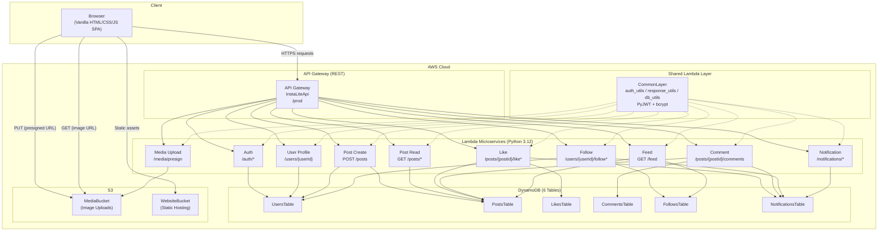
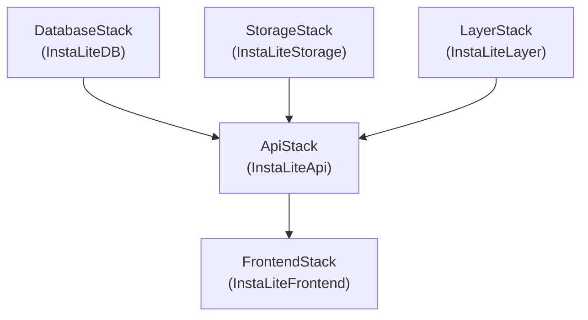

# InstaLite -- Design Document

> **Course:** CS6620 Cloud Computing, Northeastern University  
> **Project:** Instagram-Lite (InstaLite) -- Serverless Photo-Sharing SPA  
> **Date:** April 2026  

---

## Table of Contents

1. [Project Overview](#1-project-overview)
2. [Architecture Diagram](#2-architecture-diagram)
3. [Tech Stack](#3-tech-stack)
4. [Microservices](#4-microservices)
5. [Data Model](#5-data-model)
6. [Authentication Flow](#6-authentication-flow)
7. [CDK Stack Architecture](#7-cdk-stack-architecture)
8. [Deployment Guide](#8-deployment-guide)
9. [Team Assignment](#9-team-assignment)
10. [Demo Script](#10-demo-script)
11. [Extensibility Notes](#11-extensibility-notes)
12. [Project Structure](#12-project-structure)

---

## 1. Project Overview

InstaLite is a lightweight Instagram clone built entirely on AWS serverless services. The application is a **single-page application (SPA)** that allows users to sign up, share photos, follow each other, like and comment on posts, and receive real-time notifications -- all without provisioning or managing a single server.

### Key Characteristics

| Aspect | Detail |
|--------|--------|
| **Frontend** | Vanilla HTML / CSS / JavaScript SPA hosted on S3 static website |
| **Backend** | 10 independent Lambda microservices behind a single API Gateway |
| **Database** | 6 DynamoDB tables with Global Secondary Indexes |
| **Storage** | S3 bucket for user-uploaded images via presigned URLs |
| **Auth** | Custom JWT-based authentication (PyJWT + bcrypt) |
| **IaC** | AWS CDK v2 (Python) with 5 discrete stacks |
| **Runtime** | Python 3.12 on AWS Lambda |

### Core Features

- User registration and login with JWT-based sessions
- Photo upload via S3 presigned URLs (client-side direct upload)
- Post creation with captions
- Follow / unfollow other users
- Personalized feed (fan-out-on-read with parallel queries)
- Like and unlike posts (with atomic counters)
- Comments on posts
- Notification system (likes, comments, follows)
- Real-time notification badge polling
- API activity log in the browser for demo/debugging

---

## 2. Architecture Diagram



### Request Flow (simplified)

```
Browser  -->  API Gateway (/prod)  -->  Lambda Function
                                            |
                                            +--> CommonLayer (auth_utils, db_utils, response_utils)
                                            |
                                            +--> DynamoDB (read/write)
                                            |
                                            +--> S3 (presigned URL generation)
```

---

## 3. Tech Stack

### Backend

| Component | Technology | Version / Notes |
|-----------|-----------|-----------------|
| Runtime | Python | 3.12 |
| Compute | AWS Lambda | 256 MB memory, 30s timeout (60s for Feed) |
| API | AWS API Gateway | REST API, single stage (`prod`) |
| Database | AWS DynamoDB | On-demand (PAY_PER_REQUEST) billing |
| Storage | AWS S3 | CORS-enabled for direct browser uploads |
| Auth | PyJWT + bcrypt | HS256 signing, 24-hour token expiry |
| IaC | AWS CDK | v2 (Python bindings) |

### Frontend

| Component | Technology |
|-----------|-----------|
| Markup | Vanilla HTML5 |
| Styling | Vanilla CSS3 (custom properties / CSS variables) |
| Logic | Vanilla JavaScript (ES6+, no framework) |
| Routing | Hash-based SPA router (`#feed`, `#profile/{id}`, etc.) |
| Hosting | S3 static website hosting |

### Development Tools

| Tool | Purpose |
|------|---------|
| Conda | Python environment management (`cs6620` environment) |
| pip | Python package installation |
| AWS CLI | S3 sync for frontend deployment |
| CDK CLI | Infrastructure deployment and bootstrapping |

### Lambda Layer Dependencies

```
PyJWT>=2.8.0
bcrypt>=4.1.0
```

The shared Lambda Layer also bundles three custom Python modules:

- **`auth_utils.py`** -- JWT token creation and verification
- **`response_utils.py`** -- Standardized HTTP response formatting with CORS headers
- **`db_utils.py`** -- Thin DynamoDB helpers (put, get, query, GSI query, atomic counters)

---

## 4. Microservices

The backend consists of **10 Lambda microservices**, each responsible for a single domain. All Lambdas share the `CommonLayer` and receive the same environment variables (table names, bucket name, JWT secret).

### 4.1 Auth Service

**File:** `lambda_code/auth/index.py`  
**Responsibility:** User registration and login.

| Method | Endpoint | Auth Required |
|--------|----------|:------------:|
| POST | `/auth/signup` | No |
| POST | `/auth/login` | No |

#### POST /auth/signup

**Request:**
```json
{
  "username": "alice",
  "email": "alice@example.com",
  "password": "password123"
}
```

**Response (201):**
```json
{
  "token": "eyJhbGciOiJIUzI1NiIsInR5cCI6IkpXVCJ9...",
  "user": {
    "userId": "550e8400-e29b-41d4-a716-446655440000",
    "username": "alice",
    "displayName": "alice"
  }
}
```

**Error Responses:**
- `400` -- Missing required fields or password shorter than 6 characters
- `409` -- Username already taken

#### POST /auth/login

**Request:**
```json
{
  "username": "alice",
  "password": "password123"
}
```

**Response (200):**
```json
{
  "token": "eyJhbGciOiJIUzI1NiIsInR5cCI6IkpXVCJ9...",
  "user": {
    "userId": "550e8400-e29b-41d4-a716-446655440000",
    "username": "alice",
    "displayName": "alice"
  }
}
```

**Error Responses:**
- `400` -- Missing required fields
- `401` -- Invalid credentials

---

### 4.2 User Profile Service

**File:** `lambda_code/user_profile/index.py`  
**Responsibility:** Retrieve and update user profiles.

| Method | Endpoint | Auth Required |
|--------|----------|:------------:|
| GET | `/users/{userId}` | No |
| PUT | `/users/{userId}` | Yes (owner only) |

#### GET /users/{userId}

**Response (200):**
```json
{
  "userId": "550e8400-e29b-41d4-a716-446655440000",
  "username": "alice",
  "email": "alice@example.com",
  "displayName": "Alice",
  "bio": "Hello world!",
  "avatarUrl": "",
  "postCount": 5,
  "followerCount": 12,
  "followingCount": 8,
  "createdAt": 1714000000000
}
```

> Note: The `passwordHash` field is stripped from the response.

#### PUT /users/{userId}

**Request:**
```json
{
  "displayName": "Alice W.",
  "bio": "Photographer & traveler",
  "avatarUrl": "https://..."
}
```

**Response (200):** Updated user object (same shape as GET, without `passwordHash`).

**Error Responses:**
- `401` -- Unauthorized (missing or invalid token)
- `403` -- Cannot edit another user's profile
- `400` -- No updatable fields provided

---

### 4.3 Post Create Service

**File:** `lambda_code/post_create/index.py`  
**Responsibility:** Create new posts. Increments the user's `postCount`.

| Method | Endpoint | Auth Required |
|--------|----------|:------------:|
| POST | `/posts` | Yes |

#### POST /posts

**Request:**
```json
{
  "imageUrl": "https://insta-lite-media.s3.amazonaws.com/uploads/user123/abc.jpg",
  "caption": "Beautiful sunset!"
}
```

**Response (201):**
```json
{
  "postId": "660e8400-e29b-41d4-a716-446655440000",
  "userId": "550e8400-e29b-41d4-a716-446655440000",
  "username": "alice",
  "imageUrl": "https://insta-lite-media.s3.amazonaws.com/uploads/user123/abc.jpg",
  "caption": "Beautiful sunset!",
  "likeCount": 0,
  "commentCount": 0,
  "createdAt": 1714000000000
}
```

**Error Responses:**
- `401` -- Unauthorized
- `400` -- `imageUrl` is required

---

### 4.4 Post Read Service

**File:** `lambda_code/post_read/index.py`  
**Responsibility:** Retrieve a single post or list a user's posts.

| Method | Endpoint | Auth Required |
|--------|----------|:------------:|
| GET | `/posts/{postId}` | No |
| GET | `/users/{userId}/posts` | No |

#### GET /posts/{postId}

**Response (200):**
```json
{
  "postId": "660e8400-e29b-41d4-a716-446655440000",
  "userId": "550e8400-e29b-41d4-a716-446655440000",
  "username": "alice",
  "imageUrl": "https://...",
  "caption": "Beautiful sunset!",
  "likeCount": 3,
  "commentCount": 1,
  "createdAt": 1714000000000
}
```

#### GET /users/{userId}/posts

**Query Parameters:**
- `limit` (optional, default: `20`) -- Maximum number of posts to return.

**Response (200):**
```json
{
  "posts": [
    {
      "postId": "...",
      "userId": "...",
      "username": "alice",
      "imageUrl": "https://...",
      "caption": "...",
      "likeCount": 3,
      "commentCount": 1,
      "createdAt": 1714000000000
    }
  ]
}
```

> Posts are returned in reverse chronological order (newest first) via the `userId-createdAt-index` GSI.

---

### 4.5 Media Upload Service

**File:** `lambda_code/media/index.py`  
**Responsibility:** Generate S3 presigned URLs for client-side image uploads.

| Method | Endpoint | Auth Required |
|--------|----------|:------------:|
| POST | `/media/presign` | Yes |

#### POST /media/presign

**Request:**
```json
{
  "contentType": "image/jpeg",
  "filename": "sunset.jpg"
}
```

**Response (200):**
```json
{
  "uploadUrl": "https://insta-lite-media.s3.amazonaws.com/uploads/user123/uuid.jpg?X-Amz-...",
  "imageUrl": "https://insta-lite-media.s3.amazonaws.com/uploads/user123/uuid.jpg",
  "key": "uploads/user123/uuid.jpg"
}
```

**Upload Flow:**
1. Client calls `POST /media/presign` to get a presigned PUT URL (valid for 300 seconds).
2. Client performs a direct `PUT` to the presigned S3 URL with the raw image bytes.
3. Client uses the returned `imageUrl` in the subsequent `POST /posts` request.

**Error Responses:**
- `401` -- Unauthorized
- `400` -- Only `image/*` content types are supported

---

### 4.6 Like Service

**File:** `lambda_code/like/index.py`  
**Responsibility:** Like/unlike posts, list likers. Writes notifications on like.

| Method | Endpoint | Auth Required |
|--------|----------|:------------:|
| POST | `/posts/{postId}/like` | Yes |
| DELETE | `/posts/{postId}/like` | Yes |
| GET | `/posts/{postId}/likes` | No |

#### POST /posts/{postId}/like

**Response (201):**
```json
{
  "message": "Liked"
}
```

Side effects:
- Atomically increments `likeCount` on the post (via DynamoDB `ADD` expression).
- Creates a `LIKE` notification for the post owner (unless the liker is the owner).
- Uses `ConditionExpression` to prevent duplicate likes (returns `409` if already liked).

#### DELETE /posts/{postId}/like

**Response (200):**
```json
{
  "message": "Unliked"
}
```

Side effects:
- Atomically decrements `likeCount` on the post.

#### GET /posts/{postId}/likes

**Response (200):**
```json
{
  "likes": [
    {
      "postId": "660e8400-...",
      "userId": "550e8400-...",
      "createdAt": 1714000000000
    }
  ]
}
```

---

### 4.7 Comment Service

**File:** `lambda_code/comment/index.py`  
**Responsibility:** Create and list comments. Writes notifications on comment.

| Method | Endpoint | Auth Required |
|--------|----------|:------------:|
| POST | `/posts/{postId}/comments` | Yes |
| GET | `/posts/{postId}/comments` | No |

#### POST /posts/{postId}/comments

**Request:**
```json
{
  "text": "Amazing view!"
}
```

**Response (201):**
```json
{
  "postId": "660e8400-...",
  "commentId": "770e8400-...",
  "userId": "550e8400-...",
  "username": "alice",
  "text": "Amazing view!",
  "createdAt": 1714000000000
}
```

Side effects:
- Atomically increments `commentCount` on the post.
- Creates a `COMMENT` notification for the post owner (with a 50-character text preview).

**Error Responses:**
- `401` -- Unauthorized
- `400` -- Comment text is required or exceeds 500 characters

#### GET /posts/{postId}/comments

**Response (200):**
```json
{
  "comments": [
    {
      "postId": "660e8400-...",
      "commentId": "770e8400-...",
      "userId": "550e8400-...",
      "username": "alice",
      "text": "Amazing view!",
      "createdAt": 1714000000000
    }
  ]
}
```

> Comments are returned in chronological order (oldest first, `ScanIndexForward=True`).

---

### 4.8 Follow Service

**File:** `lambda_code/follow/index.py`  
**Responsibility:** Follow/unfollow users, list followers/following. Writes notifications on follow.

| Method | Endpoint | Auth Required |
|--------|----------|:------------:|
| POST | `/users/{userId}/follow` | Yes |
| DELETE | `/users/{userId}/follow` | Yes |
| GET | `/users/{userId}/followers` | No |
| GET | `/users/{userId}/following` | No |

#### POST /users/{userId}/follow

**Response (201):**
```json
{
  "message": "Followed"
}
```

Side effects:
- Atomically increments `followingCount` on the follower and `followerCount` on the followee.
- Creates a `FOLLOW` notification for the followee.
- Uses `ConditionExpression` to prevent duplicate follows (returns `409` if already following).
- Returns `400` if trying to follow yourself.

#### DELETE /users/{userId}/follow

**Response (200):**
```json
{
  "message": "Unfollowed"
}
```

Side effects:
- Atomically decrements both `followingCount` and `followerCount`.

#### GET /users/{userId}/followers

**Response (200):**
```json
{
  "followers": [
    {
      "followerId": "550e8400-...",
      "followeeId": "660e8400-...",
      "createdAt": 1714000000000
    }
  ]
}
```

> Uses the `followee-index` GSI to query by `followeeId`.

#### GET /users/{userId}/following

**Response (200):**
```json
{
  "following": [
    {
      "followerId": "550e8400-...",
      "followeeId": "660e8400-...",
      "createdAt": 1714000000000
    }
  ]
}
```

> Queries the base table directly by `followerId` (partition key).

---

### 4.9 Feed Service

**File:** `lambda_code/feed/index.py`  
**Responsibility:** Aggregate a personalized feed of posts from followed users.

| Method | Endpoint | Auth Required |
|--------|----------|:------------:|
| GET | `/feed` | Yes |

#### GET /feed

**Query Parameters:**
- `limit` (optional, default: `20`) -- Maximum number of feed posts to return.

**Response (200):**
```json
{
  "posts": [
    {
      "postId": "...",
      "userId": "...",
      "username": "bob",
      "imageUrl": "https://...",
      "caption": "Beautiful sunset!",
      "likeCount": 3,
      "commentCount": 1,
      "createdAt": 1714000000000
    }
  ]
}
```

**Feed Algorithm (fan-out-on-read):**
1. Query the `FollowsTable` to get all users the current user follows (up to 100).
2. For each followee, query the `PostsTable` GSI `userId-createdAt-index` in parallel (up to 10 threads via `ThreadPoolExecutor`) to get the latest 10 posts per user.
3. Merge and sort all posts by `createdAt` descending.
4. Return the top `limit` posts.

> This Lambda has a **60-second timeout** (vs. 30s default) to accommodate parallel queries for users who follow many accounts.

**Empty feed response:**
```json
{
  "posts": [],
  "message": "Follow someone to see their posts!"
}
```

---

### 4.10 Notification Service

**File:** `lambda_code/notification/index.py`  
**Responsibility:** List notifications and mark them as read.

| Method | Endpoint | Auth Required |
|--------|----------|:------------:|
| GET | `/notifications` | Yes |
| PUT | `/notifications/{notifId}/read` | Yes |

#### GET /notifications

**Response (200):**
```json
{
  "notifications": [
    {
      "userId": "550e8400-...",
      "notifId": "1714000000000#uuid",
      "type": "LIKE",
      "sourceUserId": "660e8400-...",
      "sourceUsername": "bob",
      "postId": "770e8400-...",
      "message": "bob liked your post",
      "isRead": false,
      "createdAt": 1714000000000
    }
  ],
  "unreadCount": 3
}
```

> Returns up to 50 notifications, newest first. The `notifId` is a composite of timestamp and UUID to ensure sort-key uniqueness and chronological ordering.

**Notification Types:**
- `LIKE` -- "{username} liked your post"
- `COMMENT` -- "{username} commented: {preview...}"
- `FOLLOW` -- "{username} started following you"

#### PUT /notifications/{notifId}/read

**Response (200):**
```json
{
  "message": "Marked as read"
}
```

---

### Microservices Summary Table

| # | Service | Lambda ID | Code Dir | Endpoints | Tables Accessed |
|---|---------|-----------|----------|-----------|-----------------|
| 1 | Auth | AuthFunction | `auth` | 2 | UsersTable |
| 2 | User Profile | UserProfileFunction | `user_profile` | 2 | UsersTable |
| 3 | Post Create | PostCreateFunction | `post_create` | 1 | PostsTable, UsersTable |
| 4 | Post Read | PostReadFunction | `post_read` | 2 | PostsTable |
| 5 | Media Upload | MediaFunction | `media` | 1 | S3 (MediaBucket) |
| 6 | Like | LikeFunction | `like` | 3 | LikesTable, PostsTable, NotificationsTable |
| 7 | Comment | CommentFunction | `comment` | 2 | CommentsTable, PostsTable, NotificationsTable |
| 8 | Follow | FollowFunction | `follow` | 4 | FollowsTable, UsersTable, NotificationsTable |
| 9 | Feed | FeedFunction | `feed` | 1 | FollowsTable, PostsTable |
| 10 | Notification | NotificationFunction | `notification` | 2 | NotificationsTable |
| | | | **Total** | **20 endpoints** | |

---

## 5. Data Model

All tables use **on-demand billing** (`PAY_PER_REQUEST`) and are configured with `RemovalPolicy.DESTROY` for easy teardown. Timestamps are stored as epoch milliseconds (Number type).

### 5.1 UsersTable

| Attribute | Type | Key | Description |
|-----------|------|-----|-------------|
| `userId` | String | **PK** | UUID v4 |
| `username` | String | | Unique username |
| `email` | String | | User email address |
| `passwordHash` | String | | bcrypt-hashed password |
| `displayName` | String | | Display name (defaults to username) |
| `bio` | String | | User bio text |
| `avatarUrl` | String | | Avatar image URL |
| `postCount` | Number | | Denormalized post count (atomic counter) |
| `followerCount` | Number | | Denormalized follower count (atomic counter) |
| `followingCount` | Number | | Denormalized following count (atomic counter) |
| `createdAt` | Number | | Epoch ms |

**Global Secondary Indexes:**

| GSI Name | Partition Key | Sort Key | Projection | Purpose |
|----------|--------------|----------|------------|---------|
| `email-index` | `email` (String) | -- | ALL | Lookup user by email |
| `username-index` | `username` (String) | -- | ALL | Lookup user by username (login, uniqueness check) |

---

### 5.2 PostsTable

| Attribute | Type | Key | Description |
|-----------|------|-----|-------------|
| `postId` | String | **PK** | UUID v4 |
| `userId` | String | | Author's user ID |
| `username` | String | | Author's username (denormalized) |
| `imageUrl` | String | | S3 image URL |
| `caption` | String | | Post caption text |
| `likeCount` | Number | | Denormalized like count (atomic counter) |
| `commentCount` | Number | | Denormalized comment count (atomic counter) |
| `createdAt` | Number | | Epoch ms |

**Global Secondary Indexes:**

| GSI Name | Partition Key | Sort Key | Projection | Purpose |
|----------|--------------|----------|------------|---------|
| `userId-createdAt-index` | `userId` (String) | `createdAt` (Number) | ALL | Query posts by user, sorted by time (profile page, feed aggregation) |

---

### 5.3 LikesTable

| Attribute | Type | Key | Description |
|-----------|------|-----|-------------|
| `postId` | String | **PK** | Post being liked |
| `userId` | String | **SK** | User who liked |
| `createdAt` | Number | | Epoch ms |

**Global Secondary Indexes:**

| GSI Name | Partition Key | Sort Key | Projection | Purpose |
|----------|--------------|----------|------------|---------|
| `userId-index` | `userId` (String) | `createdAt` (Number) | ALL | Query all posts liked by a user |

> The composite key `(postId, userId)` ensures at most one like per user per post. The `ConditionExpression` on `put_item` enforces idempotent likes.

---

### 5.4 CommentsTable

| Attribute | Type | Key | Description |
|-----------|------|-----|-------------|
| `postId` | String | **PK** | Post being commented on |
| `commentId` | String | **SK** | UUID v4 |
| `userId` | String | | Commenter's user ID |
| `username` | String | | Commenter's username (denormalized) |
| `text` | String | | Comment text (max 500 chars) |
| `createdAt` | Number | | Epoch ms |

> No GSI needed. Comments are always queried by `postId` and returned in chronological order.

---

### 5.5 FollowsTable

| Attribute | Type | Key | Description |
|-----------|------|-----|-------------|
| `followerId` | String | **PK** | User who follows |
| `followeeId` | String | **SK** | User being followed |
| `createdAt` | Number | | Epoch ms |

**Global Secondary Indexes:**

| GSI Name | Partition Key | Sort Key | Projection | Purpose |
|----------|--------------|----------|------------|---------|
| `followee-index` | `followeeId` (String) | `followerId` (String) | ALL | Query followers of a user (reverse lookup) |

> The base table serves "who does user X follow?" queries. The GSI serves "who follows user X?" queries.

---

### 5.6 NotificationsTable

| Attribute | Type | Key | Description |
|-----------|------|-----|-------------|
| `userId` | String | **PK** | Notification recipient |
| `notifId` | String | **SK** | `{timestamp}#{uuid}` (ensures uniqueness + chronological sort) |
| `type` | String | | `LIKE`, `COMMENT`, or `FOLLOW` |
| `sourceUserId` | String | | User who triggered the notification |
| `sourceUsername` | String | | Source user's username (denormalized) |
| `postId` | String | | Related post ID (empty string for FOLLOW notifications) |
| `message` | String | | Human-readable notification message |
| `isRead` | Boolean | | Read status |
| `createdAt` | Number | | Epoch ms |

> No GSI needed. Notifications are always queried by `userId` and sorted by `notifId` (which starts with a timestamp for chronological ordering).

---

### Entity Relationship Overview

```
UsersTable  1 ──── * PostsTable        (userId)
UsersTable  1 ──── * FollowsTable      (followerId / followeeId)
UsersTable  1 ──── * NotificationsTable (userId)
PostsTable  1 ──── * LikesTable        (postId)
PostsTable  1 ──── * CommentsTable      (postId)
```

---

## 6. Authentication Flow

InstaLite implements a **custom JWT-based authentication** system using the `PyJWT` library for token management and `bcrypt` for password hashing. This avoids the complexity of Amazon Cognito while demonstrating core authentication concepts.

### 6.1 Signup Flow

```
Client                          Auth Lambda                    DynamoDB (UsersTable)
  |                                  |                                |
  |  POST /auth/signup               |                                |
  |  {username, email, password}     |                                |
  | -------------------------------->|                                |
  |                                  |  Query username-index GSI      |
  |                                  |------------------------------->|
  |                                  |  (check uniqueness)            |
  |                                  |<-------------------------------|
  |                                  |                                |
  |                                  |  bcrypt.hashpw(password)       |
  |                                  |  Generate UUID userId          |
  |                                  |                                |
  |                                  |  PutItem (user record)         |
  |                                  |------------------------------->|
  |                                  |                                |
  |                                  |  jwt.encode({userId, username})|
  |                                  |                                |
  |  201 {token, user}               |                                |
  |<---------------------------------|                                |
```

### 6.2 Login Flow

```
Client                          Auth Lambda                    DynamoDB (UsersTable)
  |                                  |                                |
  |  POST /auth/login                |                                |
  |  {username, password}            |                                |
  | -------------------------------->|                                |
  |                                  |  Query username-index GSI      |
  |                                  |------------------------------->|
  |                                  |  (retrieve user record)        |
  |                                  |<-------------------------------|
  |                                  |                                |
  |                                  |  bcrypt.checkpw(password,      |
  |                                  |    user.passwordHash)          |
  |                                  |                                |
  |                                  |  jwt.encode({userId, username})|
  |                                  |                                |
  |  200 {token, user}               |                                |
  |<---------------------------------|                                |
```

### 6.3 Token Structure

```json
{
  "userId": "550e8400-e29b-41d4-a716-446655440000",
  "username": "alice",
  "iat": 1714000000,
  "exp": 1714086400
}
```

- **Algorithm:** HS256
- **Secret:** Configured via `JWT_SECRET` environment variable
- **Expiry:** 24 hours (`TOKEN_EXPIRY = 86400` seconds)

### 6.4 Protected Endpoint Verification

Every protected endpoint calls `verify_token(event)` from the shared `auth_utils` module:

1. Extract the `Authorization` header from the event.
2. Verify it starts with `Bearer `.
3. Decode and validate the JWT (checks signature and expiry).
4. Return the decoded payload `{userId, username}` or `None`.

```python
# auth_utils.py — verify_token
def verify_token(event: Dict) -> Optional[Dict]:
    headers = event.get("headers") or {}
    auth = headers.get("Authorization") or headers.get("authorization") or ""
    if not auth.startswith("Bearer "):
        return None
    token = auth[7:]
    try:
        return jwt.decode(token, JWT_SECRET, algorithms=["HS256"])
    except jwt.InvalidTokenError:
        return None
```

### 6.5 Client-Side Token Management

The frontend stores the JWT and user object in `localStorage`:

```javascript
// Save after login/signup
localStorage.setItem("inslite_token", token);
localStorage.setItem("inslite_user", JSON.stringify(user));

// Attach to every API request
headers["Authorization"] = "Bearer " + localStorage.getItem("inslite_token");

// Clear on logout
localStorage.removeItem("inslite_token");
localStorage.removeItem("inslite_user");
```

---

## 7. CDK Stack Architecture

The infrastructure is organized into **5 CDK stacks** with explicit dependency ordering. This separation enables independent development and partial redeployments.

### Stack Dependency Graph



### 7.1 DatabaseStack (`stacks/database_stack.py`)

Creates all 6 DynamoDB tables with their respective GSIs.

| Resource | Type | Key Schema |
|----------|------|------------|
| UsersTable | DynamoDB Table | PK: `userId` + 2 GSIs |
| PostsTable | DynamoDB Table | PK: `postId` + 1 GSI |
| LikesTable | DynamoDB Table | PK: `postId`, SK: `userId` + 1 GSI |
| CommentsTable | DynamoDB Table | PK: `postId`, SK: `commentId` |
| FollowsTable | DynamoDB Table | PK: `followerId`, SK: `followeeId` + 1 GSI |
| NotificationsTable | DynamoDB Table | PK: `userId`, SK: `notifId` |

All tables use:
- `BillingMode.PAY_PER_REQUEST` (on-demand, no capacity planning)
- `RemovalPolicy.DESTROY` (deleted on `cdk destroy`)

### 7.2 StorageStack (`stacks/storage_stack.py`)

Creates the S3 bucket for user-uploaded media.

| Resource | Type | Configuration |
|----------|------|---------------|
| MediaBucket | S3 Bucket | CORS (PUT/GET), BlockPublicAccess.BLOCK_ALL, auto-delete on destroy |

CORS configuration allows the browser to perform direct PUT uploads using presigned URLs:
- Allowed methods: `PUT`, `GET`
- Allowed origins: `*`
- Allowed headers: `*`
- Max age: 3600 seconds

### 7.3 LayerStack (`stacks/layer_stack.py`)

Creates the shared Lambda Layer from a pre-built zip file.

| Resource | Type | Configuration |
|----------|------|---------------|
| CommonLayer | Lambda LayerVersion | Python 3.12, built from `layers/common/layer.zip` |

The layer contains:
- `auth_utils.py` -- JWT helpers
- `response_utils.py` -- HTTP response formatting
- `db_utils.py` -- DynamoDB operation wrappers
- `PyJWT` and `bcrypt` pip packages

### 7.4 ApiStack (`stacks/api_stack.py`)

Creates the API Gateway and all 10 Lambda functions. This is the largest stack.

**API Gateway Configuration:**
- REST API with a single `prod` stage
- CORS preflight enabled for all origins
- Allowed headers: `Content-Type`, `Authorization`

**Lambda Configuration (shared):**
- Runtime: Python 3.12
- Memory: 256 MB
- Timeout: 30 seconds (60 seconds for Feed)
- Layer: CommonLayer
- Environment variables: all 6 table names + bucket name + JWT secret

**IAM Permissions (least privilege):** Each Lambda is granted only the table permissions it needs:

| Lambda | Permissions |
|--------|-------------|
| Auth | UsersTable (read/write) |
| User Profile | UsersTable (read/write) |
| Post Create | PostsTable (read/write), UsersTable (read/write) |
| Post Read | PostsTable (read only) |
| Media | MediaBucket (put + read) |
| Like | LikesTable (read/write), PostsTable (read/write), NotificationsTable (read/write) |
| Comment | CommentsTable (read/write), PostsTable (read/write), NotificationsTable (read/write) |
| Follow | FollowsTable (read/write), UsersTable (read/write), NotificationsTable (read/write) |
| Feed | FollowsTable (read only), PostsTable (read only) |
| Notification | NotificationsTable (read/write) |

**Outputs:**
- `ApiUrl` -- The API Gateway endpoint URL (e.g., `https://xxxxx.execute-api.us-east-1.amazonaws.com/prod/`)

### 7.5 FrontendStack (`stacks/frontend_stack.py`)

Creates the S3 bucket for hosting the static SPA.

| Resource | Type | Configuration |
|----------|------|---------------|
| WebsiteBucket | S3 Bucket | Static website hosting, public read, index/error = `index.html` |

**Outputs:**
- `WebsiteUrl` -- The S3 website endpoint URL
- `FrontendBucketName` -- Bucket name (used by deploy script for `aws s3 sync`)

---

## 8. Deployment Guide

### Prerequisites

- AWS CLI configured with valid credentials
- Node.js (for CDK CLI)
- Python 3.12
- Conda (recommended) or virtualenv

### Step-by-Step Deployment

#### 1. Set up the Python environment

```bash
conda activate cs6620
pip install -r requirements.txt
```

#### 2. Build the Lambda Layer

```bash
cd layers/common
chmod +x build_layer.sh
./build_layer.sh --force
cd ../..
```

This installs `PyJWT` and `bcrypt` for the `manylinux2014_x86_64` platform (Lambda runtime), copies the utility Python files, and creates `layer.zip`.

#### 3. Bootstrap CDK (first time only)

```bash
cdk bootstrap
```

#### 4. Deploy all stacks

```bash
cdk deploy --all --require-approval never --outputs-file cdk-outputs.json
```

This deploys the 5 stacks in dependency order:
1. `InstaLiteDB` (DynamoDB tables)
2. `InstaLiteStorage` (S3 media bucket)
3. `InstaLiteLayer` (Lambda layer)
4. `InstaLiteApi` (API Gateway + Lambdas)
5. `InstaLiteFrontend` (S3 static website bucket)

#### 5. Update frontend config and upload

```bash
# Extract API URL from CDK outputs
API_URL=$(python3 -c "
import json
d = json.load(open('cdk-outputs.json'))
for stack in d.values():
    for k, v in stack.items():
        if 'ApiUrl' in k:
            print(v)
            break
    else: continue
    break
")

# Inject API URL into frontend config
sed -i.bak "s|PLACEHOLDER_API_URL|${API_URL}|g" frontend/js/config.js

# Upload frontend to S3
BUCKET=$(python3 -c "
import json
d = json.load(open('cdk-outputs.json'))
for stack in d.values():
    for k, v in stack.items():
        if 'FrontendBucketName' in k:
            print(v)
            break
    else: continue
    break
")
aws s3 sync frontend/ "s3://${BUCKET}/" --delete
```

#### Automated Deployment (recommended)

The entire process above is automated in a single script:

```bash
./scripts/deploy.sh
```

### Cleanup

```bash
./scripts/cleanup.sh
```

This restores the `PLACEHOLDER_API_URL` in `config.js` and runs `cdk destroy --all --force`.

---

## 9. Team Assignment

The project is designed for a team of **5 members**, with each person owning **2 microservices** (Person E also owns the frontend SPA).

### Assignment Matrix

| Person | Microservices | Scope |
|--------|--------------|-------|
| **Person A** | Auth + User Profile | JWT authentication system, password hashing with bcrypt, user CRUD, Lambda Layer (shared utilities) |
| **Person B** | Post Create + Media Upload | S3 presigned URL generation, client-side direct upload flow, post creation with metadata |
| **Person C** | Post Read + Feed | DynamoDB query patterns, GSI design, fan-out-on-read feed aggregation with ThreadPoolExecutor |
| **Person D** | Like + Comment | Social interaction logic, atomic counters (DynamoDB ADD), conditional writes, notification triggers |
| **Person E** | Follow + Notification + Frontend | Follow graph with reverse GSI, notification system, SPA (HTML/CSS/JS), hash-based router, S3 static hosting |

### Detailed Responsibilities

#### Person A: Auth + User Profile + Lambda Layer

**Deliverables:**
- `lambda_code/auth/index.py` -- Signup and login handlers
- `lambda_code/user_profile/index.py` -- Profile get/update handlers
- `layers/common/python/auth_utils.py` -- JWT create/verify helpers
- `layers/common/python/response_utils.py` -- HTTP response helpers with CORS
- `layers/common/python/db_utils.py` -- DynamoDB operation wrappers
- `layers/common/build_layer.sh` -- Layer build script
- `stacks/database_stack.py` -- UsersTable with GSIs
- `stacks/layer_stack.py` -- Lambda Layer stack

**Key Concepts:**
- PyJWT HS256 token creation and validation
- bcrypt password hashing and verification
- DynamoDB GSI queries (username-index, email-index)
- Lambda Layer packaging for cross-function code sharing

#### Person B: Post Create + Media Upload

**Deliverables:**
- `lambda_code/post_create/index.py` -- Post creation handler
- `lambda_code/media/index.py` -- Presigned URL generation handler
- `stacks/storage_stack.py` -- S3 bucket with CORS configuration

**Key Concepts:**
- S3 presigned URL generation (`generate_presigned_url`)
- Client-side direct upload to S3 (bypasses API Gateway 10 MB limit)
- S3 CORS configuration for cross-origin PUT requests
- Atomic counter increment for `postCount`

#### Person C: Post Read + Feed

**Deliverables:**
- `lambda_code/post_read/index.py` -- Single post and user posts handlers
- `lambda_code/feed/index.py` -- Feed aggregation handler

**Key Concepts:**
- DynamoDB GSI query with `ScanIndexForward=False` for reverse chronological ordering
- Fan-out-on-read pattern for feed generation
- `ThreadPoolExecutor` for parallel DynamoDB queries
- Lambda timeout configuration (60s for Feed)

#### Person D: Like + Comment

**Deliverables:**
- `lambda_code/like/index.py` -- Like, unlike, and list likes handlers
- `lambda_code/comment/index.py` -- Create and list comments handlers

**Key Concepts:**
- DynamoDB conditional writes (`ConditionExpression`) for idempotent likes
- Atomic counters (`ADD` expression) for `likeCount` and `commentCount`
- Cross-table writes (LikesTable + PostsTable + NotificationsTable in one handler)
- Notification creation as a side effect

#### Person E: Follow + Notification + Frontend

**Deliverables:**
- `lambda_code/follow/index.py` -- Follow, unfollow, followers, following handlers
- `lambda_code/notification/index.py` -- List notifications and mark-as-read handlers
- `frontend/` -- Entire SPA (HTML, CSS, JS)
- `stacks/frontend_stack.py` -- S3 static website stack
- `stacks/api_stack.py` -- API Gateway route definitions

**Key Concepts:**
- Bidirectional follow graph with reverse GSI (`followee-index`)
- Notification polling with `setInterval` (10-second interval)
- Hash-based SPA routing (`#feed`, `#profile/{id}`, etc.)
- Vanilla JS DOM manipulation and event handling
- Toast notifications and API activity log for debugging

### Shared / Collaborative Work

| Resource | Owner | Collaborators |
|----------|-------|---------------|
| `app.py` (CDK entry point) | Person E | All |
| `stacks/api_stack.py` (routes + Lambdas) | Person E | All (each person adds their Lambda definition) |
| `stacks/database_stack.py` | Person A | All (each person adds their tables) |
| `scripts/deploy.sh` | Person A | All |
| `scripts/demo.sh` | Person E | All |

---

## 10. Demo Script

This is a **10-step live demonstration** designed to showcase all features in approximately 5-8 minutes. The presenter uses two browser windows (one regular, one incognito) to simulate two users.

### Step 1: Open the Application

1. Open the InstaLite website URL in a browser.
2. The login/signup page is displayed with the InstaLite logo and "Share photos with friends" tagline.
3. Point out: "This is a static SPA hosted entirely on S3. There are no servers."

### Step 2: Sign Up as Alice

1. Click "Sign up" on the login page.
2. Fill in: email `alice@demo.com`, username `alice`, password `password123`.
3. Click "Sign Up".
4. Observe: The API Activity Log shows `POST /auth/signup -> 201`.
5. Alice is redirected to an empty feed with the message "Follow someone to see their posts!"
6. Point out: "The JWT token was returned and stored in localStorage. All subsequent requests will include it as a Bearer token."

### Step 3: Sign Up as Bob (Incognito Window)

1. Open an incognito/private window and navigate to the same URL.
2. Sign up as `bob` with email `bob@demo.com` and password `password123`.
3. Bob is now logged in with his own JWT token.

### Step 4: Bob Creates a Post

1. In Bob's window, click the "+" button in the navbar.
2. Select an image file from the computer.
3. Add the caption "Beautiful sunset from the rooftop!"
4. Click "Share Post".
5. Observe the API Activity Log:
   - `POST /media/presign -> 200` (Lambda generates presigned URL)
   - A toast says "Uploading image to S3..." (direct PUT to S3)
   - `POST /posts -> 201` (post created in DynamoDB)
6. Point out: "The image was uploaded directly from the browser to S3 via a presigned URL -- it never passes through API Gateway or Lambda. This is important because API Gateway has a 10 MB payload limit."

### Step 5: Alice Follows Bob

1. Switch to Alice's window.
2. Navigate to Bob's profile (via URL `#profile/{bobUserId}` or by entering Bob's user ID).
3. Click the "Follow" button.
4. Observe: Button changes to "Following", follower count increments.
5. API log shows `POST /users/{bobId}/follow -> 201`.

### Step 6: Alice Sees Bob's Post in Feed

1. Click the Home icon in Alice's navbar (or navigate to `#feed`).
2. Bob's post appears in the feed with the image and caption.
3. Point out: "The Feed Lambda uses a fan-out-on-read pattern. It queries who Alice follows, then fetches recent posts from each followee in parallel using ThreadPoolExecutor."

### Step 7: Alice Likes the Post

1. Click the heart icon on Bob's post in Alice's feed.
2. The heart turns red and the like count increments.
3. API log shows `POST /posts/{postId}/like -> 201`.
4. Point out: "The Like Lambda performs three operations: insert into LikesTable (with a conditional write to prevent duplicates), atomically increment likeCount on the post, and create a notification for Bob."

### Step 8: Alice Comments on the Post

1. Click the comment icon on Bob's post to open the post detail page.
2. Type "Amazing view!" in the comment input and press Enter.
3. The comment appears immediately below the post.
4. API log shows `POST /posts/{postId}/comments -> 201`.
5. Point out: "Similar to likes, the Comment Lambda also atomically increments commentCount and creates a notification."

### Step 9: Bob Checks Notifications

1. Switch to Bob's window.
2. Notice the notification badge on the bell icon shows a count (should be 3: follow + like + comment).
3. Click the bell icon to view the notifications page.
4. Three notifications are displayed:
   - "alice started following you" (FOLLOW)
   - "alice liked your post" (LIKE)
   - "alice commented: Amazing view!" (COMMENT)
5. Click on a notification to mark it as read and navigate to the related content.
6. Point out: "The notification badge polls every 10 seconds. Each notification is created as a side effect by the Like, Comment, and Follow Lambdas."

### Step 10: Architecture Walkthrough

Present the architecture diagram and explain:

1. **Serverless:** No EC2 instances, no containers -- everything runs on Lambda.
2. **Microservices:** 10 independent Lambda functions, each with a single responsibility.
3. **Shared Layer:** Common utilities (JWT auth, response formatting, DB helpers) are shared via a Lambda Layer.
4. **DynamoDB Design:** 6 tables with GSIs designed for specific access patterns. Denormalized counters avoid expensive count queries.
5. **S3 Direct Upload:** Presigned URLs bypass API Gateway for large files.
6. **CDK IaC:** 5 stacks, all infrastructure defined as code, deployable with a single command.
7. **Cost:** At rest, this application costs $0. All services are pay-per-request with free tier eligibility.

### Backup: curl-based Demo

If the frontend is unavailable, use the automated curl demo script:

```bash
./scripts/demo.sh https://xxxxx.execute-api.us-east-1.amazonaws.com/prod
```

---

## 11. Extensibility Notes

The architecture is designed for easy extension. Here is how to add common enhancements.

### Adding a New API Endpoint to an Existing Service

1. **Add the route** in `stacks/api_stack.py`:
   ```python
   some_resource = post_resource.add_resource("some-new-thing")
   some_resource.add_method("GET", apigateway.LambdaIntegration(existing_fn, proxy=True))
   ```
2. **Add the handler** in the corresponding `lambda_code/<service>/index.py`:
   ```python
   elif method == "GET" and resource == "/posts/{postId}/some-new-thing":
       return handle_new_thing(event)
   ```
3. **Deploy:** `cdk deploy InstaLiteApi`

### Adding a New Microservice

1. **Create the Lambda code** at `lambda_code/new_service/index.py`.
2. **Register it** in `stacks/api_stack.py`:
   ```python
   new_fn = self._create_lambda("NewServiceFunction", "new_service")
   some_table.grant_read_write_data(new_fn)
   ```
3. **Add routes** to the API Gateway in the same file.
4. **Deploy:** `cdk deploy InstaLiteApi`

### Adding a New DynamoDB Table

1. **Define the table** in `stacks/database_stack.py`:
   ```python
   self.new_table = dynamodb.Table(
       self, "NewTable",
       partition_key=dynamodb.Attribute(name="pk", type=dynamodb.AttributeType.STRING),
       billing_mode=dynamodb.BillingMode.PAY_PER_REQUEST,
       removal_policy=RemovalPolicy.DESTROY,
   )
   ```
2. **Export it** from the DatabaseStack (it is already a class attribute via `self.new_table`).
3. **Pass it** to ApiStack in `app.py`:
   ```python
   api = ApiStack(app, "InstaLiteApi", ..., new_table=db.new_table)
   ```
4. **Add the table name** to the Lambda environment in `api_stack.py`.
5. **Deploy:** `cdk deploy --all`

### Potential Feature Extensions

| Feature | Implementation Sketch |
|---------|----------------------|
| **Search** | New Lambda + DynamoDB Scan with filter expressions (or integrate OpenSearch for full-text) |
| **Stories** | New table (`StoriesTable`) with TTL for auto-expiry, new Lambda for create/list |
| **Direct Messages** | New `MessagesTable` (PK: conversationId, SK: timestamp), new Lambda with WebSocket API Gateway |
| **Image Resizing** | S3 event trigger -> Lambda that creates thumbnails using Pillow |
| **CloudFront CDN** | Add a CloudFront distribution in front of the S3 media bucket for global caching |
| **Cognito Auth** | Replace custom JWT with Amazon Cognito User Pools and API Gateway authorizers |
| **CI/CD** | Add a CodePipeline / GitHub Actions workflow that runs `cdk deploy` on push to main |
| **Monitoring** | Enable CloudWatch dashboards, X-Ray tracing, and Lambda Insights |
| **Pagination** | Return `LastEvaluatedKey` from DynamoDB queries and accept a `cursor` query parameter |
| **Delete Post** | New endpoint `DELETE /posts/{postId}` that removes the post, associated likes, comments, and S3 object |

---

## 12. Project Structure

```
final_project_inslite/
|
|-- app.py                              # CDK entry point — defines 5 stacks and their dependencies
|-- cdk.json                            # CDK app configuration and context flags
|-- requirements.txt                    # CDK Python dependencies (aws-cdk-lib, constructs)
|
|-- stacks/                             # CDK stack definitions
|   |-- __init__.py
|   |-- database_stack.py               # 6 DynamoDB tables + GSIs
|   |-- storage_stack.py                # S3 media bucket with CORS
|   |-- layer_stack.py                  # Shared Lambda Layer
|   |-- api_stack.py                    # API Gateway + 10 Lambda functions
|   |-- frontend_stack.py              # S3 static website bucket
|
|-- lambda_code/                        # Lambda function source code (one directory per microservice)
|   |-- auth/
|   |   |-- index.py                    # Signup + Login handlers
|   |-- user_profile/
|   |   |-- index.py                    # Get/Update profile handlers
|   |-- post_create/
|   |   |-- index.py                    # Create post handler
|   |-- post_read/
|   |   |-- index.py                    # Get post + Get user's posts handlers
|   |-- media/
|   |   |-- index.py                    # S3 presigned URL generation handler
|   |-- like/
|   |   |-- index.py                    # Like/Unlike/List likes handlers
|   |-- comment/
|   |   |-- index.py                    # Create/List comments handlers
|   |-- follow/
|   |   |-- index.py                    # Follow/Unfollow/Followers/Following handlers
|   |-- feed/
|   |   |-- index.py                    # Feed aggregation handler (fan-out-on-read)
|   |-- notification/
|       |-- index.py                    # List notifications + Mark as read handlers
|
|-- layers/                             # Lambda Layer source
|   |-- common/
|       |-- build_layer.sh              # Script to build layer.zip (installs PyJWT, bcrypt)
|       |-- layer.zip                   # Built layer artifact (git-ignored in production)
|       |-- python/
|           |-- requirements.txt        # Layer pip dependencies (PyJWT, bcrypt)
|           |-- auth_utils.py           # JWT create_token / verify_token
|           |-- response_utils.py       # success_response / error_response / CORS headers
|           |-- db_utils.py             # put_item / get_item / query / update_counter
|
|-- frontend/                           # Static SPA (uploaded to S3)
|   |-- index.html                      # Single HTML page (shell for SPA)
|   |-- css/
|   |   |-- style.css                   # Instagram-inspired CSS (custom properties, responsive)
|   |-- js/
|       |-- config.js                   # API_BASE_URL config (placeholder replaced at deploy time)
|       |-- components.js               # Shared UI: toast, spinner, navbar, avatar, post card, toggleLike
|       |-- api.js                      # Fetch wrapper with auth headers + API activity log
|       |-- auth.js                     # Login/Signup forms + Quick Demo Login
|       |-- feed.js                     # Feed page renderer
|       |-- post.js                     # New Post page + Post Detail page with comments
|       |-- profile.js                  # Profile page with follow/unfollow + posts grid
|       |-- notifications.js            # Notifications page with mark-as-read
|       |-- router.js                   # Hash-based SPA router
|
|-- scripts/                            # Utility scripts
|   |-- deploy.sh                       # Full deployment: build layer, cdk deploy, upload frontend
|   |-- cleanup.sh                      # Tear down: restore config, cdk destroy
|   |-- demo.sh                         # curl-based demo script (backup for live demo)
|
|-- tests/                              # Test directory (for unit/integration tests)
|
|-- cdk.out/                            # CDK synthesized output (CloudFormation templates)
```

---

## Appendix: API Endpoint Quick Reference

| Method | Endpoint | Service | Auth |
|--------|----------|---------|:----:|
| `POST` | `/auth/signup` | Auth | No |
| `POST` | `/auth/login` | Auth | No |
| `GET` | `/users/{userId}` | User Profile | No |
| `PUT` | `/users/{userId}` | User Profile | Yes |
| `POST` | `/posts` | Post Create | Yes |
| `GET` | `/posts/{postId}` | Post Read | No |
| `GET` | `/users/{userId}/posts` | Post Read | No |
| `POST` | `/media/presign` | Media Upload | Yes |
| `POST` | `/posts/{postId}/like` | Like | Yes |
| `DELETE` | `/posts/{postId}/like` | Like | Yes |
| `GET` | `/posts/{postId}/likes` | Like | No |
| `POST` | `/posts/{postId}/comments` | Comment | Yes |
| `GET` | `/posts/{postId}/comments` | Comment | No |
| `POST` | `/users/{userId}/follow` | Follow | Yes |
| `DELETE` | `/users/{userId}/follow` | Follow | Yes |
| `GET` | `/users/{userId}/followers` | Follow | No |
| `GET` | `/users/{userId}/following` | Follow | No |
| `GET` | `/feed` | Feed | Yes |
| `GET` | `/notifications` | Notification | Yes |
| `PUT` | `/notifications/{notifId}/read` | Notification | Yes |

**Total: 20 endpoints across 10 microservices.**
